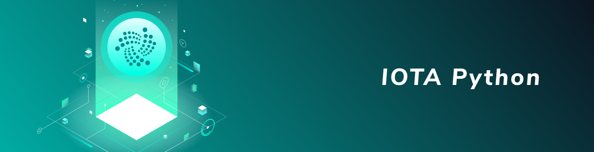

<h1 align="center">
  <br>
  <a href="https://docs.iota.org/docs/client-libraries/0.1/getting-started/python-quickstart"></a>
</h1>

<h2 align="center">The official Python client library for interacting with the Tangle</h2>

<p align="center">
    <a href="https://docs.iota.org/docs/client-libraries/0.1/getting-started/python-quickstart" style="text-decoration:none;">
    
      </p>
<p align="center">
  <a href="http://pyota.readthedocs.io/en/latest/?badge=latest" style="text-decoration:none;"></a>
  <a href="https://discord.iota.org/" style="text-decoration:none;"></a>
  <a href="https://iota.stackexchange.com/" style="text-decoration:none;"></a>
  <a href="https://github.com/iotaledger/entangled/blob/develop/LICENSE" style="text-decoration:none;"></a>
  <a href="https://docs.iota.org/docs/node-software/0.1/iri/references/api-reference" style="text-decoration:none;"></a>
  <a href="https://travis-ci.org/iotaledger/iota.py" style="text-decoration:none;"></a>
</p>
      
<p align="center">
  <a href="#about">About</a> ◈
  <a href="#prerequisites">Prerequisites</a> ◈
  <a href="#installation">Installation</a> ◈
  <a href="#getting-started">Getting started</a> ◈
  <a href="#examples">Examples</a> ◈
  <a href="#supporting-the-project">Supporting the project</a> ◈
  <a href="#joining-the-discussion">Joining the discussion</a> 
</p>

---

## About

This is the **official** Python client library, which allows you to do the following:
* Create transactions
* Read transactions
* Sign transactions
* Generate addresses

This is beta software, so there may be performance and stability issues.
Please report any issues in our [issue tracker](https://github.com/iotaledger/iota.py/issues/new).

## Prerequisites

To install the IOTA Python client library and its dependencies, you need Python version 3.7 or 3.6 installed on your device.

## Installation

To download the IOTA Python client library and its dependencies, do the following:

```bash
pip install pyota
```

### Installing the optional C extension

PyOTA has an optional C extension that improves the performance of its
cryptography features by an average of **60 times**.

To install this extension, do the following:

```bash
pip install pyota[ccurl]
```

### Installing the optional module for local proof of work

To do proof of work on your local device without relying on a node,
you can install the [PyOTA-PoW](https://pypi.org/project/PyOTA-PoW/) extension module.

To install this extension, use the following command::

```bash
pip install pyota[pow]
```

When you've installed this module, you can use it by passing the `local_pow=True` argument to your API instance. Doing so will redirect all `attach_to_tangle`
API calls to an interface function in the `pow` package.

### Installing from source

To install the library from the source code on GitHub, do the following:

```bash
# Recommended, but not required
Create virtualenv
git clone https://github.com/iotaledger/iota.py.git
pip install -e .
```

## Getting started

After you've [installing the library](#installation), you can connect to an IRI node to send transactions to it and interact with the ledger.
An extended guide can be found on our [documentation portal](https://docs.iota.org/docs/client-libraries/0.1/getting-started/python-quickstart), we strongly recommend you to go here for starting off. A quick starting tutorial is shown below.

To connect to a local IRI node, you can do the following:

```py
from iota import Iota

# Create a new instance of the IOTA API object
# Specify which node to connect to
api = Iota(adapter = 'https://nodes.devnet.iota.org:443')

# Call the `get_node_info()` method for information about the node and the Tangle
response = api.get_node_info()

print(response)
```

## Examples

We have a list of test cases in the [`examples` directory](https://github.com/iotaledger/iota.py/tree/master/examples) that you can use as a reference when developing apps with IOTA.

Here's how you could send a zero-value transaction, using the library. For the guide, see the [documentation portal](https://docs.iota.org/docs/client-libraries/0.1/how-to-guides/python/send-your-first-bundle).

```python
# You don't need a seed to send zero-value transactions
api = Iota('https://nodes.devnet.iota.org:443', devnet=True)

# Define a message to send.
# This message must include only ASCII characters.
message = TryteString.from_unicode('Hello world')

# Define an address.
# This does not need to belong to anyone or have IOTA tokens.
# It must only contain a maximum of 81 trytes
# or 90 trytes with a valid checksum
address = 'ZLGVEQ9JUZZWCZXLWVNTHBDX9G9KZTJP9VEERIIFHY9SIQKYBVAHIMLHXPQVE9IXFDDXNHQINXJDRPFDXNYVAPLZAW'

# Define a zero-value transaction object
# that sends the message to the address
tx = ProposedTransaction(
    address = Address(address),
    message = message,
    value = 0
)

# Create a bundle from the `ProposedTransaction` object
# and send the transaction to the node
result = api.send_transfer(transfers=[tx])

print('Bundle: ')

print(result['bundle'].hash)
```

## Supporting the project

If the IOTA Python client library has been useful to you and you feel like contributing, consider posting a [bug report](https://github.com/iotaledger/iota.py/issues/new-issue), feature request or a [pull request](https://github.com/iotaledger/iota.py/pulls/). 

We have some [basic contribution guidelines](.github/CONTRIBUTING.md) to keep our code base stable and consistent.

### Running test cases

To run test, do the following:

```bash
python setup.py test
```

PyOTA is also compatible with [tox](https://tox.readthedocs.io/), which will run the unit tests in different virtual environments (one for each supported version of Python).

To run the unit tests, it is recommended that you use the `-p` argument.
This speeds up the tests by running them in parallel.

Install PyOTA with the `test-runner` extra to set up the necessary
dependencies, and then you can run the tests with the `tox` command::

```bash
pip install -e .[test-runner]
tox -v -p all
```

### Building the autogenerated documentation

The autogenerated documentation can be generated on your local device by doing the following:

```bash
# Install extra dependencies (you only have to do this once)
pip install .[docs-builder]
cd docs
# Build the documentation::
make html
```

## Joining the discussion

If you want to get involved in the community, need help with getting set up, have any issues related with the library or just want to discuss blockchain, distributed ledgers, and IoT with other people, feel free to join our [Discord](https://discord.iota.org/).
