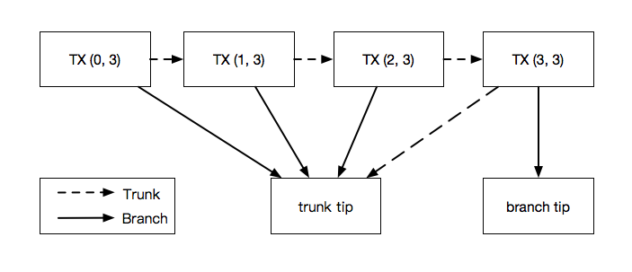

Basic Concepts
==============

Before diving into the API, it's important to understand the fundamental
data types of IOTA.

The `official IOTA documentation site`_ gives a good and in-depth explanation of the
concepts used in IOTA. PyOTA documentation will try to give references to the
official site wherever possible.

Ternary
-------

IOTA uses the `ternary numerical system`_ to represent data. The smallest unit of
information is a ``trit``, that can have a value of -1, 0 or 1 in a balanced
ternary system. A combination of 3 ``trits`` equals one ``tryte``, therefore a
``tryte`` can have 3 * 3 * 3 = 27 different values.

To represent a ``tryte``, IOTA encodes these 27 values into characters based on
the `tryte alphabet`_.

.. py:currentmodule:: iota

In PyOTA, ``trits`` are represented as a sequence of numerical values (``List[int]``)
while trytes have their own class called :py:class:`TryteString`.

IOTA token
----------

The `IOTA token`_ is a `unit`_ of value that can be transferred over an IOTA
network through `transfer bundles`_.

The IOTA token was launched on the Mainnet in June 2017. At this point, the
nodes in the network were hard-coded with a total supply of 2,779,530,283 277,761.
This large supply allows each of the billions of devices, which are expected to
be a part of the Internet of Things, to have its own wallet and transact
micropayments with other devices.

Seed
----

`Seed`_ in IOTA is your unique password. It is the digital key that unlocks
your safe that holds your tokens, or proves the ownership of messages.

Seeds in PyOTA are always 81 trytes long and may only contain characters from
the `tryte alphabet`_.

.. warning::
    Treat your seed(s) the same as you would the password for any other financial service.
    Never share your seed with anyone, and never use online generators to create a seed.
    The library can help you to create your own locally and it does not require
    internet connection: :py:meth:`iota.crypto.Seed.random`.

For PyOTA-specific implementation details on seeds, see :py:class:`crypto.Seed`.

Address
-------

To send or receive any transaction (let them be zero-value or value transacitons)
in IOTA, you will need to specify an `address`_. An address is like a physical mailbox
on your entrance door: anyone can drop things in your mailbox (send you messages
or tokens), but only you can empty it (withdraw tokens).

.. warning::
    Addresses should not be re-used once they are `spent from`_.
    **You can receive as many transactions to an address as you wish, but only
    spend from that address once.**

Addresses are generated from your seed through cryptographic functions. There
are 9\ :sup:`57`\  different addresses that one might generate from a seed,
which is quite a lot. Given your ``seed``, the ``index`` and ``security level``
parameters specify which address will be generated from it. The process is
deterministic, meaning that same input paramteres always generate the same address.

Addresses are 81 trytes long and may contain extra 9 trytes for checksum.
The checksum may be used to verify that an address is in fact a valid IOTA address.

For-PyOTA specific implementation details on addresses, see :py:class:`Address`.

Transaction
-----------

    *A transaction is a single transfer instruction that can either withdraw IOTA
    tokens from an address, deposit them into an address, or have zero-value
    (contain data, a message, or a signature). If you want to send anything to an
    IOTA network, you must send it to a node as a transaction.*

    ---  from the `official IOTA documentation site`_

Transactions are always 2673 trytes long and their `structure`_ is defined by
the protocol. They can be classified into three categories:

- `Input transaction`_: A transaction that withdraws tokens from an address.
- `Output transaction`_: A transaction that deposits tokens to an address.
- `Zero-value transaction`_: A transaction that has 0 value and might carry messages
  or signatures.

Depending on the type of the transaction, different fields are required to be filled.

A transaction's unique identifier in IOTA is the :py:class:`TransactionHash`,
that is generated from the trytes of the transaction. If any trytes change
in the transaction, the returning transaction hash would alter. This way, transaction
hashes ensure the immutability of the Tangle.

To become accepted by the network, a transaction has to be attached to the Tangle.
The attachment process means that the transaction should reference two unconfirmed
transactions (tips) in the Tangle and do a small proof-of-work. This process might
be performed by a node, or by using the local proof-of-work feature of the `client
libraries`_.

For PyOTA-specific implementation details on transactions, see :py:class:`Transaction`
and :py:class:`ProposedTransaction`.

Bundle
------

    *A bundle is a group of transactions that rely on each other's validity.
    For example, a transaction that deposits IOTA tokens into an address relies on
    another transaction to withdraw those IOTA tokens from another address.
    Therefore, those transactions must be in the same bundle.*

    ---  from the `official IOTA documentation site`_

In other words, a bundle is collection of transactions, treated as an atomic unit when
attached to the Tangle.

.. note::
    Unlike a block in a blockchain, bundles are not first-class
    citizens in IOTA; only transactions get stored in the Tangle.

    Instead, bundles must be inferred by following linked transactions
    with the same bundle hash.

Transactions in the bundle are linked together through their ``trunkTransaction``
fields, furthermore they are indexed within the bundle and contain a ``bundleHash``
field that is a `unique identifier for the bundle`_.

   Structure of a bundle with four transactions. Numbers in brackets denote
   (``currentIndex``, ``lastIndex``) fields. Head of the bundle has index 0,
   while tail has index 3.

Read more about `how bundles are structured`_.

Bundles can be classified into two categories:

- `Transfer bundles`_: Bundles that contain input and output transactions. A bundle
  always has to be balanced, meaning that input transaction values should equal
  to output transaction values.
- `Zero-value bundles`_: Bundles that contain only zero-value transactions.

For PyOTA-specific implementation details on bundles, see :py:class:`Bundle`
and :py:class:`ProposedBundle`.

Now that you are familiar with some basic IOTA concepts, it is time to explore
how PyOTA implements these and how you can work with them.

.. _official IOTA documentation site: https://docs.iota.org/docs/getting-started/0.1/introduction/overview
.. _ternary numerical system: https://docs.iota.org/docs/getting-started/0.1/introduction/ternary
.. _tryte alphabet: https://docs.iota.org/docs/getting-started/0.1/introduction/ternary#tryte-encoding
.. _iota token: https://docs.iota.org/docs/getting-started/0.1/clients/token
.. _iota network: https://docs.iota.org/docs/getting-started/0.1/network/iota-networks
.. _unit: https://docs.iota.org/docs/getting-started/0.1/clients/token#units-of-iota-tokens
.. _seed: https://docs.iota.org/docs/getting-started/0.1/clients/seeds
.. _address: https://docs.iota.org/docs/getting-started/0.1/clients/addresses
.. _spent from: https://docs.iota.org/docs/getting-started/0.1/clients/addresses#spent-addresses
.. _structure: https://docs.iota.org/docs/getting-started/0.1/transactions/transactions#structure-of-a-transaction
.. _input transaction: https://docs.iota.org/docs/getting-started/0.1/transactions/transactions#input-transactions
.. _output transaction: https://docs.iota.org/docs/getting-started/0.1/transactions/transactions#output-transactions
.. _zero-value transaction: https://docs.iota.org/docs/getting-started/0.1/transactions/transactions#zero-value-transactions
.. _client libraries: https://docs.iota.org/docs/client-libraries/0.1/introduction/overview
.. _how bundles are structured: https://docs.iota.org/docs/getting-started/0.1/transactions/bundles
.. _unique identifier for the bundle: https://docs.iota.org/docs/getting-started/0.1/transactions/bundles#bundle-hash
.. _transfer bundles: https://docs.iota.org/docs/getting-started/0.1/transactions/bundles#transfer-bundles
.. _zero-value bundles: https://docs.iota.org/docs/getting-started/0.1/transactions/bundles#zero-value-bundle
