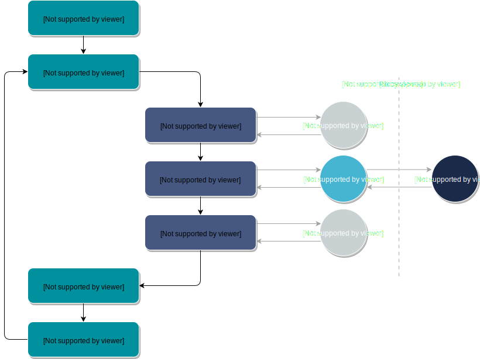

Advanced: PyOTA Commands
========================

.. note::
    **This page contains information about how PyOTA works under the hood.**

    It is absolutely not necessary to be familiar with the content described
    below if you just want to use the library.

    However, if you are a curious mind or happen to do development on the
    library, the following information might be useful.

PyOTA provides the API interface (:ref:`core_api:Core API Methods` and
:ref:`extended_api:Extended API Methods`) for users of the library. These handle
constructing and sending HTTP requests to the specified node through adapters,
furthermore creating, transforming and translating between PyOTA-specific types
and (JSON-encoded) raw data. They also filter outgoing requests and incoming
responses to ensure that only appropriate data is communicated with the node.

PyOTA implements the `Command Design Pattern`_. High level API interface
methods (:ref:`core_api:Core API Methods` and :ref:`extended_api:Extended API Methods`)
internally call PyOTA commands to get the job done.

Most PyOTA commands are sub-classed from :py:class:`FilterCommand` class, which
is in turn sub-classed from :py:class:`BaseCommand` class. The reason for the
2-level inheritance is simple: separating functionality. As the name implies,
:py:class:`FilterCommand` adds filtering capabilities to
:py:class:`BaseCommand`, that contains the logic of constructing the request
and using its adapter to send it and receive a response.

Command Flow
------------
As mentioned earlier, API methods rely on PyOTA commands to carry out
specific operations. It is important to understand what happens during command
execution so you are able to implement new methods that extend the current
capabilities of PyOTA.

.. py:currentmodule:: iota

Let's investigate the process through an example of a core API method, for
instance :py:meth:`~Iota.find_transactions`, that calls
:py:class:`FindTransactionCommand` PyOTA command internally.

.. note::
    :py:class:`FindTransactionCommand` is sub-classed from :py:class:`FilterCommand`.

To illustrate what the happens inside the API method, take a look at the
following figure

   Inner workings of a PyOTA Command.

- When you call :py:meth:`~Iota.find_transactions` core API method, it
  initializes a :py:class:`FindTransactionCommand` object with the adapter of the
  API instance it belongs to.

- Then calls this command with the keyword arguments it was provided with.

- The command prepares the request by applying a ``RequestFilter`` on the
  payload. The command specific ``RequestFilter`` validates that the payload
  has correct types, in some cases it is even able to convert the payload to
  the required type and format.

- Command execution injects the name of the API command (see `IRI API Reference`_
  for command names) in the request and sends it to the adapter.

- The adapter communicates with the node and returns its response.

- The response is prepared by going through a command-specific
  ``ResponseFilter``.

- The response is returned to the high level API method as a ``dict``, ready
  to be returned to the main application.

.. note::
    A command object can only be called once without resetting it. When you
    use the high level API methods, you don't need to worry about resetting
    commands as each call to an API method will initialize a new command object.

Filters
-------

If you take a look at the actual implementation of
:py:class:`FindTransactionsCommand`, you notice that you have to define your
own request and response filter classes.

Filters in PyOTA are based on the `Filters library`_. Read more about how
they work at the `filters documentation site`_.

In short, you can create filter chains through which the filtered value passes,
and generates errors if something failed validation. Filter chains are specified
in the custom filter class's :py:meth:`__init__` function. If you also want to
modify the filtered value before returning it, override the :py:meth:`_apply`
method of its base class. Read more about how to `create custom filters`_.

PyOTA offers you some custom filters for PyOTA-specific types:

**Trytes**
~~~~~~~~~~
.. autoclass:: iota.filters.Trytes

**StringifiedTrytesArray**
~~~~~~~~~~~~~~~~~~~~~~~~~~
.. automethod:: iota.filters.StringifiedTrytesArray

**AddressNoChecksum**
~~~~~~~~~~~~~~~~~~~~~
.. autoclass:: iota.filters.AddressNoChecksum

**GeneratedAddress**
~~~~~~~~~~~~~~~~~~~~
.. autoclass:: iota.filters.GeneratedAddress

**NodeUri**
~~~~~~~~~~~
.. autoclass:: iota.filters.NodeUri
    :members: SCHEMES

**SecurityLevel**
~~~~~~~~~~~~~~~~~~~~
.. automethod:: iota.filters.SecurityLevel

.. important::
    The general rule in PyOTA is that all requests going to a node are
    validated, but only responses that contain transaction/bundle trytes or
    hashes are checked.

    Also note, that for extended commands, ``ResponseFilter`` is usually
    implemented with just a "pass" statement. The reason being that these
    commands do not directly receive their result a node, but rather from
    core commands that do have their ``ResponseFilter`` implemented.
    More about this topic in the next section.

Extended Commands
-----------------

Core commands, like :py:meth:`~Iota.find_transactions` in the example above,
are for direct communication with the node for simple tasks such
as finding a transaction on the Tangle or getting info about the node.
Extended commands (that serve :ref:`extended_api:Extended API Methods`) on the other hand
carry out more complex operations such as combining core commands, building
objects, etc...

As a consequence, extended commands override the default execution phase of their
base class.

Observe for example :py:class:`FindTransactionObjectsCommand` extended command
that is called in :py:meth:`~Iota.find_transaction_objects` extended API
method. It overrides the :py:meth:`_execute` method of its base class.

Let's take a closer look at the implementation::

    ...
    def _execute(self, request):
        bundles = request\
            .get('bundles')  # type: Optional[Iterable[BundleHash]]
        addresses = request\
            .get('addresses')  # type: Optional[Iterable[Address]]
        tags = request\
            .get('tags')  # type: Optional[Iterable[Tag]]
        approvees = request\
            .get('approvees')  # type: Optional[Iterable[TransactionHash]]

        ft_response = FindTransactionsCommand(adapter=self.adapter)(
            bundles=bundles,
            addresses=addresses,
            tags=tags,
            approvees=approvees,
        )

        hashes = ft_response['hashes']
        transactions = []
        if hashes:
            gt_response = GetTrytesCommand(adapter=self.adapter)(hashes=hashes)

            transactions = list(map(
                Transaction.from_tryte_string,
                gt_response.get('trytes') or [],
            ))  # type: List[Transaction]

        return {
            'transactions': transactions,
        }
    ...

Instead of sending the request to the adapter,
:py:meth:`FindTransactionObjectsCommand._execute` calls
:py:class:`FindTransactionsCommand` core command, gathers the transaction hashes
that it found, and collects the trytes of those transactions by calling
:py:class:`GetTrytesCommand` core command. Finally, using the obtained trytes,
it constructs a list of transaction objects that are returned to
:py:meth:`~Iota.find_transaction_objects`.

.. important::
    If you come up with a new functionality for the PyOTA API, please raise
    an issue in the `PyOTA Bug Tracker`_ to facilitate discussion.

    Once the community agrees on your proposal, you may start implementing
    a new extended API method and the corresponding extended PyOTA command.

    Contributions are always welcome! :)

    Visit the `Contributing to PyOTA`_ page to find out how you can make a
    difference!

.. _Command Design Pattern: https://en.wikipedia.org/wiki/Command_pattern
.. _IRI API Reference: https://docs.iota.org/docs/node-software/0.1/iri/references/api-reference
.. _Filters library: https://pypi.org/project/phx-filters/
.. _filters documentation site: https://filters.readthedocs.io/en/latest/
.. _create custom filters: https://filters.readthedocs.io/en/latest/writing_filters.html
.. _PyOTA Bug Tracker: https://github.com/iotaledger/iota.py/issues
.. _Contributing to PyOTA: https://github.com/iotaledger/iota.py/blob/master/.github/CONTRIBUTING.md