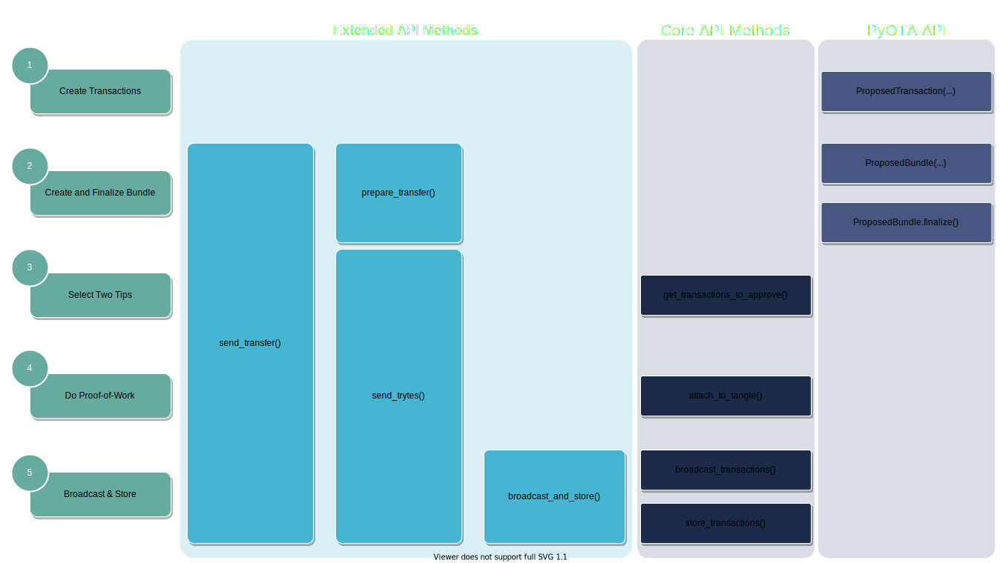

Creating transfers
==================

IOTA is a permissionless DLT solution, therefore anyone can send transactions
to the network and initiate transfers. The IOTA client libraries help you to
abstract away low-level operations required to construct and send a transfer
to the Tangle.

In this section, we will explore in depth how to create transactions and
bundles with IOTA, furthermore what tools you can use in PyOTA to ease your
development process.

.. note::

    Before proceeding, make sure you read and understood the
    :ref:`basic_concepts:Basic Concepts` and :ref:`types:PyOTA Types` sections!

Anatomy of a Transfer
---------------------

We already know that the Tangle consists of :ref:`transactions <basic_concepts:Transaction>`
referencing each other, each of them two others to be more precise.
Transactions can be grouped together in :ref:`bundles <basic_concepts:Bundle>`.
`Zero-value bundles`_ contain only zero value transactions, while
`transfer bundles`_ may also contain input and output transactions.

But how to construct these bundles and send them to the network?

The process can be boiled down to 5 steps:

    1. Create individual transaction(s).
    2. Construct a bundle from the transaction(s).
    3. Obtain references to two unconfirmed transactions ("tips") from the Tangle.
    4. Do proof-of-work for each transaction in the bundle.
    5. Send the bundle to the network.

.. figure:: images/create_transfer.svg
   :scale: 100 %
   :alt: Process of sending a transfer in IOTA.

   Process of creating and sending a transfer to the Tangle.

.. py:currentmodule:: iota

1. Create Transactions
~~~~~~~~~~~~~~~~~~~~~~
The first step is to create the individual transaction objects. You have to
specify ``address`` and ``value`` for each transaction.  Furthermore, you can define a ``tag``, and for
zero-value transactions, a ``message``.  A ``timestamp`` is also required, though this value is usually auto-generated
by the IOTA libraries.

.. note::
  Unlike on other decentralised ledgers, IOTA transactions can have positive *or* negative ``value`` amounts.  In order to send iotas from one address to another, at least two transactions are required:
  
  * one with *positive* ``value`` (to increment the balance of the receiver), and
  * one with *negative* ``value`` (to decrement the balance of the sender).

In PyOTA, use :py:class:`ProposedTransaction` to declare transactions.

2. Create Bundle from Transactions
~~~~~~~~~~~~~~~~~~~~~~~~~~~~~~~~~~
A bundle is a collection of transactions, treated as an atomic unit
when sent to the network. A bundle makes a value (iota token) transfer possible by
grouping together input and output transactions.

A bundle always has to be balanced: the sum of ``value`` attributes of the
transactions in the bundle should always be zero. Transactions in the bundle
are also indexed individually and contain information on how many other
transactions there are in the bundle.

Once complete, a bundle has to be finalized to generate the bundle hash based
on the `bundle essence`_. The bundle hash is the unique identifier of the
bundle.

After finalization, input transactions in the bundle need to be signed to prove
ownership of iotas being transferred.

.. tip:
  :py:class:`ProposedBundle` helps you in PyOTA to create bundles, add transactions,
  finalize the bundle and sign the inputs.  We'll see how to use :py:class:`ProposedBundle` in
  :ref:`Use the Library` below.

3. Select two tips
~~~~~~~~~~~~~~~~~~

Tips are transactions that are yet to be confirmed by the network. We can
obtain two tips by requesting them from a node. In PyOTA, :py:meth:`~Iota.get_transactions_to_approve`
does the job: it returns a ``trunk`` and a ``branch`` :py:class:`TransactionHash`.

Because our bundle references these two transactions, it will validate them once it is added to the Tangle.

4. Do Proof-of-Work
~~~~~~~~~~~~~~~~~~~

The bundle has been finalized, inputs have been signed, and we have two tips;
now it's time to prepare the bundle to be attached to the Tangle. As noted in the previous section, every
transaction references two other transactions in the Tangle; therefore we need
to select these references for each transaction in our bundle.

We also know that transactions `within the bundle are linked together`_ through
their trunk references. So how do we construct the correct bundle structure
and also reference two tips from the network?

.. figure:: images/bundle-structure.png
   :scale: 100 %
   :alt: Bundle structure with four transactions.

   Structure of a bundle with four transactions. Numbers in brackets denote
   (``currentIndex``, ``lastIndex``) fields. Head of the bundle has index 3,
   while tail has index 0.

For all non-head transactions in the bundle, the trunk reference is the next
transaction in the bundle, while the branch reference is the trunk transaction
hash, one of the tips.

The head transaction is different: the trunk reference is the trunk tip, while
the branch reference is the branch tip.

The proof-of-work calculation has to be done for each transaction individually,
therefore the more transactions you have in the bundle, the more time it will
take. The difficulty of the calculation also depends on the `minimum weight magnitude`_
set by the network.

The output of the proof-of-work algorithm is a ``nonce`` value that is appended
to the the transaction, resulting in the attached transaction trytes.
Nodes validate the proof-of-work of a transaction by calculating the transaction's
hash from the attached transaction trytes. If the resulting hash has at least
``minimum weight magnitude`` number of trailing zero trits, the transaction is valid.

In PyOTA, use :py:meth:`~Iota.attach_to_tangle` to carry out this step.

5. Broadcast and Store
~~~~~~~~~~~~~~~~~~~~~~

The final step is to send the bundle to the network. Nodes will broadcast
the transactions in the network, and store them in their local database.

In PyOTA, use :py:meth:`~Iota.broadcast_and_store` to achieve this.

Observe the bird's-eye view of the Tangle depicted at the last step of the
process. Our transactions are part of the Tangle, referencing each other and
the two tips. Newer transactions may reference our transactions as branch or
trunk.

Use the Library
---------------

The IOTA libraries help you to abstract away the low-level operations needed
to create transfers. The figure below illustrates the different ways you can
build and send a transfer.

   API commands for sending transfers.

Let's look at some code snippets on how to perform the above with an imaginary
bundle that has 3 fictional transactions.

1. Level Padawan
~~~~~~~~~~~~~~~~
The easiest and most convenient way is to use :py:meth:`~Iota.send_transfer`
extended API method. You still need to create the transactions yourself
with :py:class:`ProposedTransaction`.

.. code-block::

    from iota import Iota, ProposedTransaction, Address

    api = Iota('https://nodes.devnet.iota.org:443')

    fictional_transactions = [
        ProposedTransaction(
                address=Address(b'FIRSTRANDOMADDRESS'),
                value=0,
                # You could add a tag or message here too!
        ),
        ProposedTransaction(
                address=Address(b'SECONDRANDOMADDRESS'),
                value=0,
        ),
        ProposedTransaction(
                address=Address(b'THIRDRANDOMADDRESS'),
                value=0,
        )
    ]

    imaginary_bundle = api.send_transfer(
        transfers=transactions
    )['bundle']

As all API methods in PyOTA, :py:meth:`~Iota.send_transfer` also returns
a ``dict``. The ``bundle`` key holds the value of :py:class:`Bundle`.

It's important to note, that for value transfers, you will need your seed as well.
:py:meth:`~Iota.send_transfer` will look for ``input addresses`` to fund outgoing
transactions in the bundle, and auto-generate an unused ``change address`` if
there is a remainder amount of tokens. It will also take care of finalizing the
bundle and signing the necessary input transactions.

2. Level Obi-Wan
~~~~~~~~~~~~~~~~
Instead of :py:meth:`~Iota.send_transfer`, you can use the combination of
:py:meth:`~Iota.prepare_transfer` and :py:meth:`~Iota.send_trytes` to achieve
the same result.

.. tip::
  This can be useful if you want to prepare the transactions (including signing inputs) on one device, but you want to then transfer the data to another device for transmission to the Tangle.  For example, you might :py:meth:`~Iota.prepare_transfer` on an air-gapped computer that has your seed stored on it, but then transfer the resulting trytes to a networked computer (that does not have your seed) to :py:meth:`~Iota.send_trytes`.

.. code-block::

    from iota import Iota, ProposedTransaction, Address

    api = Iota('https://nodes.devnet.iota.org:443')

    transactions = [
        ProposedTransaction(
                address=Address(b'FIRSTRANDOMADDRESS'),
                value=0,
        ),
        ProposedTransaction(
                address=Address(b'SECONDRANDOMADDRESS'),
                value=0,
        ),
        ProposedTransaction(
                address=Address(b'THIRDRANDOMADDRESS'),
                value=0,
        )
    ]

    prepared_trytes = api.prepare_transfer(
        transfers=transactions
    )['trytes']

    imaginary_bundle_trytes = api.send_trytes(
        trytes=prepared_trytes
    )['trytes']

A difference here is that the end result, ``imaginary_bundle_trytes`` is a list
of :py:class:`TransactionTrytes`, and not a :py:class:`Bundle` object.

3. Level Yoda
~~~~~~~~~~~~~
Being the master Jedi of the PyOTA universe means that you know the most about
the force of low-level API methods. Use it wisely!

.. tip::
  You generally won't need to split out the process explicitly like this in your application code, but it is useful to understand what :py:meth:`~Iota.send_transfer` does under-the-hood, so that you are better-equipped to troubleshoot any issues that may occur during the process.

.. code-block::

    from iota import Iota, ProposedTransaction, Address, ProposedBundle

    api = Iota('https://nodes.devnet.iota.org:443')

    transactions = [
        ProposedTransaction(
                address=Address(b'FIRSTRANDOMADDRESS'),
                value=0,
        ),
        ProposedTransaction(
                address=Address(b'SECONDRANDOMADDRESS'),
                value=0,
        ),
        ProposedTransaction(
                address=Address(b'THIRDRANDOMADDRESS'),
                value=0,
        )
    ]

    bundle = ProposedBundle()

    for tx in transactions:
        bundle.add_transaction(tx)

    # If it was a value transfer, we would also need to:
    # bundle.add_inputs()
    # bundle.send_unspent_inputs_to()

    bundle.finalize()

    # Again, for value transfers, we would need to:
    # bundle.sign_inputs(KeyGenerator(b'SEEDGOESHERE'))

    gtta_response = api.get_transactions_to_approve(depth=3)

    trunk = gtta_response['trunkTransaction']
    branch = gtta_response['branchTransaction']

    attached_trytes = api.attach_to_tangle(
        trunk_transaction=trunk,
        branch_transaction=branch,
        trytes=bundle.as_tryte_strings()
    )['trytes']

    api.broadcast_transactions(attached_trytes)

    api.store_transactions(attached_trytes)

    imaginary_bundle = Bundle.from_tryte_strings(attached_trytes)

.. _transfer bundles: https://docs.iota.org/docs/getting-started/0.1/transactions/bundles#transfer-bundles
.. _zero-value bundles: https://docs.iota.org/docs/getting-started/0.1/transactions/bundles#zero-value-bundle
.. _bundle essence: https://docs.iota.org/docs/getting-started/0.1/transactions/bundles#bundle-essence
.. _within the bundle are linked together: https://docs.iota.org/docs/getting-started/0.1/transactions/bundles
.. _minimum weight magnitude: https://docs.iota.org/docs/getting-started/0.1/network/minimum-weight-magnitude
